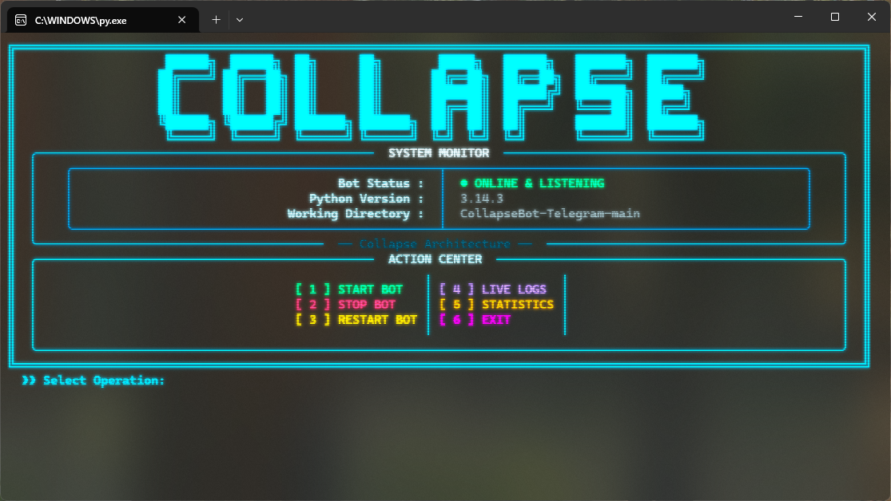
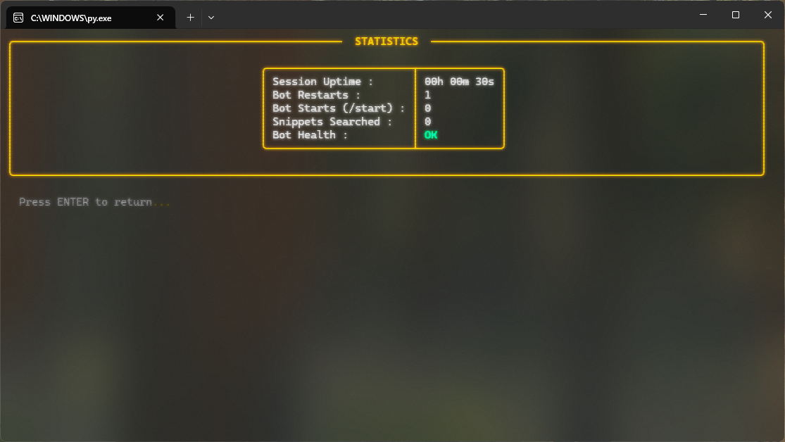
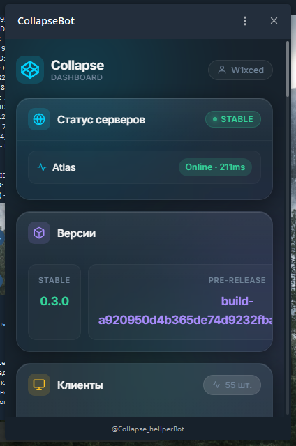

# CollapseBot-Telegram

A simple and efficient Telegram bot built with Python.

## How to Create & Run

### 1. Create a Bot via BotFather
1. Open Telegram and search for **@BotFather**.
2. Send the command `/newbot`.
3. Enter a name for your bot (e.g., `CollapseBot`).
4. Create a username for your bot (must end in `bot`, e.g., `collapse_test_bot`).
5. BotFather will send you an **HTTP API Token**. Copy it.

### 2. Configure Settings
1. In BotFather, type `/mybots`.
2. Select your bot.
3. Go to **Bot Settings** > **Inline Mode** and turn it **ON** (if required).

### 3. Setup Local Environment
1. Clone this repository.
2. Create a file named `.env` in the root directory.
3. Paste your API Token into the `.env` file:
   ```env
   BOT_TOKEN=your_copied_api_token_here

### CLI Design main menu

<div align="center">
  
</div>

### CLI Design statistics

<div align="center">
  
</div>

### Design mini app

<div align="center">
  
</div>
